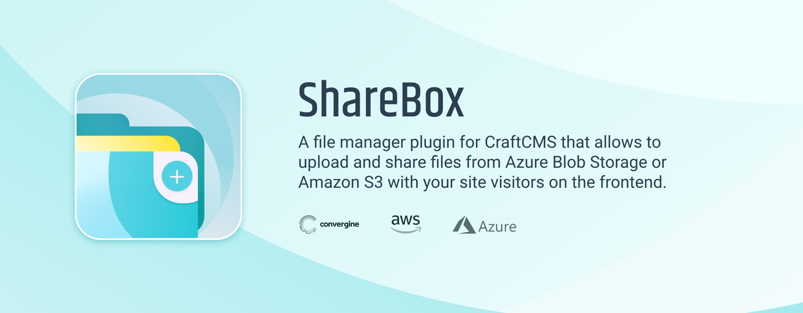
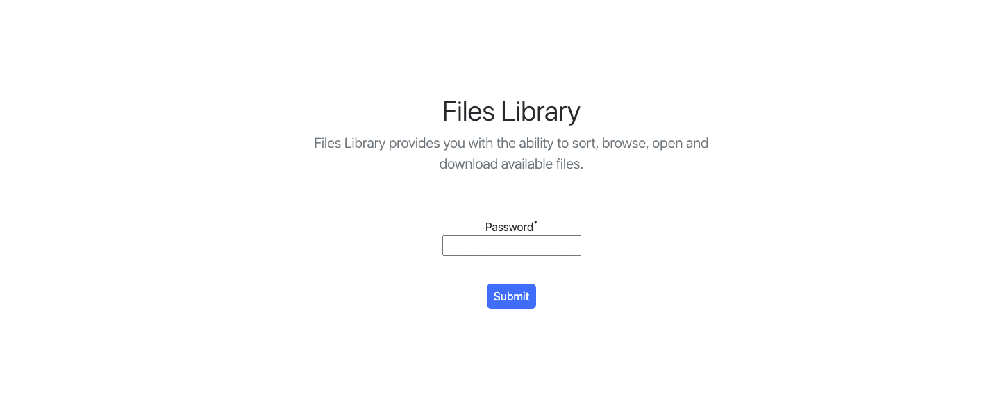
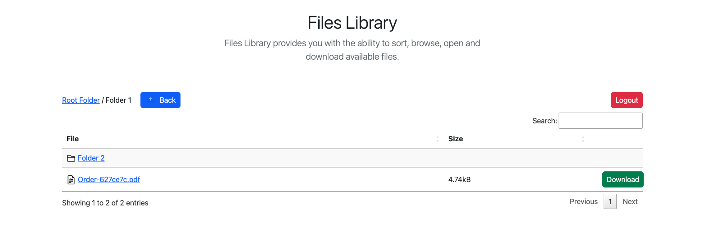
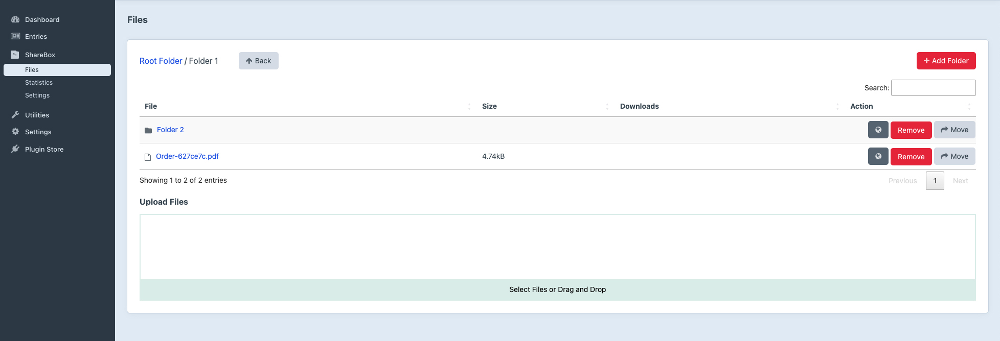
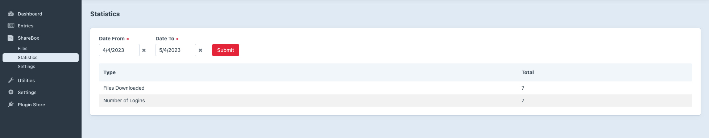
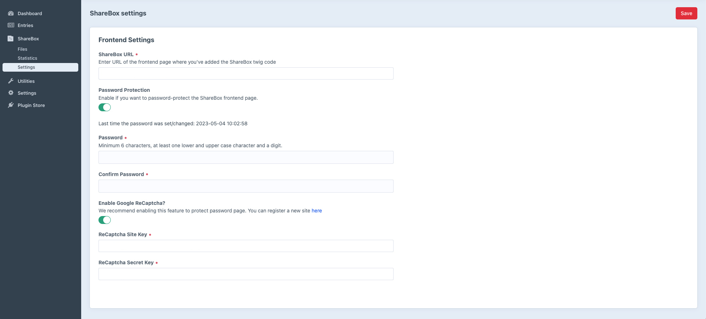

# ShareBox for Craft CMS 4


ShareBox is a file manager plugin for CraftCMS v4.x that allows to upload and share files from Azure Blob Storage or Amazon S3 with your site visitors on the frontend.

For the plugin to work, an Amazon S3 ( https://aws.amazon.com/s3/ ) or Azure Blob Storage ( https://azure.microsoft.com/en-us/products/storage/blobs ) account is required and an Azure Blob Storage API key must be created https://learn.microsoft.com/en-us/rest/api/storageservices/blob-service-rest-api.

> **Note:** The plugin works only with the files and folders that will be created after connecting the plugin to your Azure/Amazon instance. It cannot display files or folders that already exist on your Azure/Amazon account. Only files / folders created through plugin will show up in directory view)

## Features
- AWS Integration: Easily upload files to Amazon S3 and share them in a "directory-view" on your website frontend
- Microsoft Azure Integration: Easily upload files to Azure Blob Storage and share them in a "directory-view" on your website frontend
- Password protect the files directory view on the front page (optional)
- Google ReCaptcha integration for the directory view
- Simple download statistics

## Requirements
- Azure Blob Storage or Amazon S3 account is rewquired for this plugin to work
- Craft CMS 4.0.0 or later
- PHP 8.0.2 or later

## Installation
1. You can install this plugin from the Plugin Store or with Composer
```bash
# installation with composer

# 1. go to the project directory
cd /path/to/my-project

# 2. tell Composer to load the plugin
composer require convergine/craft-sharebox

# 3. tell Craft to install the plugin
./craft plugin/install craft-sharebox
```

2. Activate the plugin in the CraftCMS Control Panel (if it's not yet activated)
3. Edit your .env file and add the following variables:
```
# for Azure Blob Storage
SHAREBOX_PROVIDER=AZUREBLOB

# edit the following variables with your own values
AZURE_BLOB_STORAGE_KEY1=your_key
AZURE_BLOB_STORAGE_ACCOUNT_NAME=accountname
AZURE_CONTAINER=container
```
or
```
# for Amazon S3
SHAREBOX_PROVIDER=AMAZONS3

# edit the following variables with your own values
AWS_ACCESS_KEY_ID=your_key
AWS_SECRET_ACCESS_KEY=your_secret_key
AWS_REGION=ca-central-1
AWS_BUCKET=your_bucket
```
4. Configure the settings in plugin menu in the CraftCMS Control Panel

Go to ShareBox settings and enter the full URL of the page where you are going to display the file sharing 
`e.g. https://www.yourdomain.com/files-directory`

5.  Adjust the twig template to display ShareBox:
```
# register the asset bundle (somewhere at the top of the file)


# add the following code where you want the directory to show up

{{ files|raw }}
```
6. Now you are ready to proceed with uploading files through the plugin interface in the CraftCMS Control Panel. 

> **Note:** If you decide to switch between Azure/Amazon after you've already created folders and uploaded files through the plugin interface, you will need to re-upload everything through plugin again, after the provider switch, as the plugin will see new provider's container as completely empty.

## Customizing Design

At the moment, the only way to adjust the design of the frontend directory view is to either add the same styles that are used in Sharebox' frontend.css with `!important` attribute, or to add adjusted styles within your template where Sharebox' twig code is placed.
Editing the styles directly in plugin files will result in overwritten changed upon update of the plugin.

## Support

For any issues or questions, you can reach us by email info@convergine.com or by opening an issue on GitHub.
 

## Roadmap
- Support for local file storage
- Improved statistics

## Screenshots




